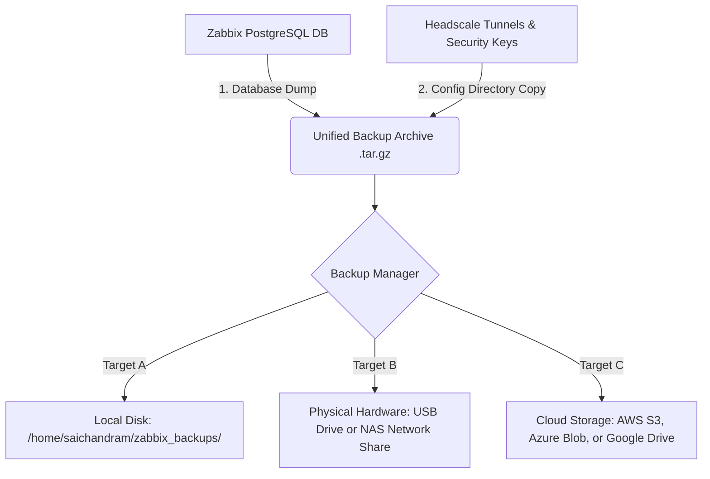

# 🛡️ Zabbix NOC & Headscale VPN — Complete Backup & Restore Setup Guide (From Scratch)

This guide provides a step-by-step walkthrough to set up, schedule, and run backups from a **completely fresh installation** of this Zabbix & Headscale platform. Even if you have never configured a backup system before, this guide will help you achieve a production-grade backup strategy.

---

## 📐 Network & Storage Data Flow

Here is how data flows from your running services to your secure backup storage:



---

## 📋 Step 1: Install the Required Tools

First, log in to your Ubuntu Server terminal and install the utilities required for database dumping and cloud synchronization:

```bash
# 1. Update your system package repository
sudo apt update

# 2. Install rclone (for Cloud Storage) and PostgreSQL Client (for Database dumping)
sudo apt install rclone postgresql-client -y
```

---

## 🛠️ Step 2: Configure Your Backup Destination (S3, Azure, or Drive)

You need to tell the server where to upload your backup files. We use **rclone** because it supports virtually every cloud provider in the world.

### For Cloud Storage (AWS S3, Azure, Google Drive, OneDrive)
1. Run the interactive cloud link setup wizard:
   ```bash
   sudo rclone config
   ```
2. Type **`n`** to create a new remote configuration, and name it: **`zabbix`**
3. Select your storage provider from the list (e.g., `s3` for AWS, `azureblob` for Azure, `drive` for Google Drive).
4. Enter your credentials:
   * **For AWS S3**: Enter Access Key ID, Secret Access Key, Region (`ap-south-1` for India), and location constraints.
   * **For Azure Blob**: Enter your Azure Storage Account name and Access Key.
   * **For Google Drive**: Follow the 1-click web login authorization prompt.
5. Exit the wizard by typing **`q`**.

### For Physical Hardware Storage (USB Drive or NAS Network share)
If you are using a physical external hard drive or an office NAS:
1. Plug in the USB drive or configure your NAS shared folder (NFS/Samba).
2. Mount the drive to a directory on your server:
   ```bash
   sudo mkdir -p /mnt/backup_hardware
   sudo mount /dev/sdX1 /mnt/backup_hardware  # For USB
   # OR
   sudo mount -t nfs <NAS_IP>:/shared_folder /mnt/backup_hardware  # For NAS
   ```

---

## 🪣 Step 3: Create the Backup Container/Bucket

Before running the backup, you must create the bucket/folder in your cloud storage:

```bash
# Create the bucket (replace 'zabbix-backups-saichandram' with your own unique name)
sudo rclone mkdir zabbix:zabbix-backups-saichandram
```

---

## ⚙️ Step 4: Configure Your Backup Script Variables

Inside your cloned Zabbix repository, navigate to the backup script folder:
`scripts/backups/`

Open **[backup.sh](file:///home/saichandram/zabbix/scripts/backups/backup.sh)** in a text editor and update the following settings to match your database and folder paths:

```bash
# Open script for editing:
nano scripts/backups/backup.sh
```

### Config variables to check inside the script:
*   `BACKUP_DIR`: Path where local backups are stored on this server (e.g. `/home/saichandram/zabbix_backups`).
*   `HEADSCALE_DIR`: Path where your headscale folder is located (e.g. `/home/saichandram/headscale`).
*   `DB_NAME`: Zabbix database name (default: `zabbix`).
*   `DB_USER`: Zabbix database user (default: `zabbix`).
*   `DB_PASS`: Zabbix database password (default: `StrongPassword@123`).
*   `rclone copy ...`: Modify `"zabbix:zabbix-backups-saichandram"` to match your configured rclone remote and bucket name.

Make the scripts executable on your system:
```bash
chmod +x scripts/backups/backup.sh scripts/backups/backup_manager.sh scripts/backups/restore.sh
```

---

## 🚀 Step 5: Test Run the Backup

Let's test the backup manually to ensure the database dumps successfully, files compress, and upload to the cloud works:

```bash
sudo ./scripts/backups/backup.sh
```

### Expected Output Logs:
```text
=== [1/5] Creating directories ===
=== [2/5] Exporting Zabbix PostgreSQL Database ===
=== [3/5] Backing up Headscale configuration and security keys ===
=== [4/5] Compressing all backup components into unified archive ===
=== [5/5] Backup created successfully ===
Local Backup File: /home/saichandram/zabbix_backups/noc_backup_xxxxxx.tar.gz
=== [Sync] Uploading backup to AWS S3 bucket via rclone ===
=== [Sync] Upload complete ===
```

To verify the file is physically present in the cloud, run:
```bash
sudo rclone lsf zabbix:zabbix-backups-saichandram
```

---

## ⏰ Step 6: Setup Automatic Daily Backups (Cron Job)

To configure the server to run this backup automatically every night at **2:00 AM**:

1. Create a cron configuration file in `/etc/cron.d/`:
   ```bash
   sudo nano /etc/cron.d/zabbix-backup
   ```
2. Paste the following line inside the file:
   ```text
   0 2 * * * root /home/saichandram/zabbix/scripts/backups/backup.sh > /var/log/zabbix_backup.log 2>&1
   ```
3. Save and close (Ctrl+O, Enter, Ctrl+X).
4. The system will now automatically run the backup daily. You can monitor the logs at `/var/log/zabbix_backup.log`.

---

## 🔄 Step 7: How to Restore (Disaster Recovery on a New Server)

If your server crashes, or you need to migrate to a completely new machine, follow this restore process:

### 1. Set up the new server:
* Clone this repository onto the new server:
  ```bash
  git clone https://github.com/saichandram-sadhu/Zabbix.git
  cd Zabbix
  ```
* Launch the empty Zabbix & Headscale containers:
  ```bash
  docker compose up -d
  ```

### 2. Run the Restore Script:
Get your backup archive file (`noc_backup_xxxx.tar.gz`) from your S3 Cloud / USB Drive, copy it to the new server, and run:

```bash
sudo ./scripts/backups/restore.sh /path/to/noc_backup_xxxx.tar.gz
```

### What this script does automatically behind the scenes:
1. Stops the running Zabbix Server and Docker containers to prevent database writing locks.
2. Drops the current empty database and recreates it.
3. Restores the database schema and full monitoring history from your backup dump.
4. Overwrites the Headscale folders with the restored keys, ensuring all your remote proxies connect immediately without needing registration.
5. Restarts all services and Zabbix Server.
