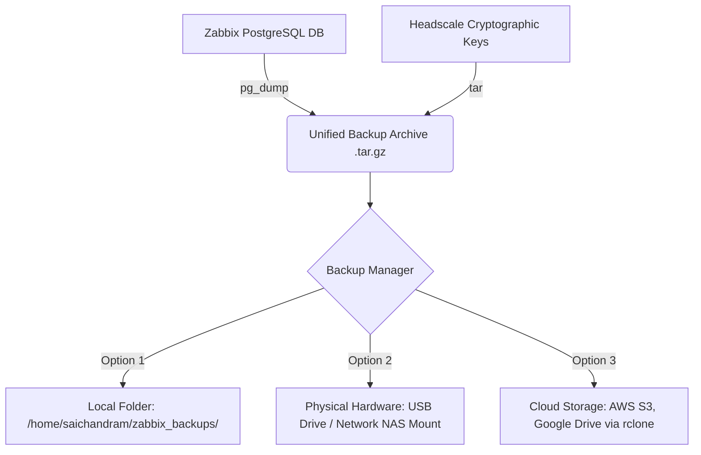

# 🛡️ Zabbix NOC & Headscale VPN — Backup & Recovery Guide

Welcome to the **Disaster Recovery & Backup Guide** for the Zabbix NOC Monitoring and Headscale VPN mesh platform. 

This guide details the system architecture, setup steps, manual commands, and automatic scheduling for Zabbix server configuration and VPN security key backups.

---

## 📐 Backup & Recovery System Architecture

This system packages the relational configuration metrics (PostgreSQL) and cryptographic security state (Headscale keys) into a unified, secure archive file, and synchronizes it across three potential destination targets:



---

## 🛠️ The Interactive Backup Command Center

We have developed a comprehensive command-line tool, [backup_manager.sh](file:///home/saichandram/zabbix/scripts/backups/backup_manager.sh), to let you easily trigger backups and restores using an interactive console menu.

### How to Run:
Launch the script as root:
```bash
sudo /home/saichandram/zabbix/scripts/backups/backup_manager.sh
```

### Options Available:
1. **Create Backup**: Instantly dumps the database and keys, compresses them, and prompts you to select where to copy the file (Local, Physical USB/NAS, or Cloud Bucket).
2. **Restore Backup**: Lists local backup archives, allows picking an external path, or downloads directly from your cloud buckets, then drops the current database and restores everything in a single step.
3. **Configure Cloud Connection**: Interactive shortcut wizard to link your Google Drive, AWS S3, OneDrive, or Dropbox storage bucket.

---

## 🗄️ 1. Local & Physical Hardware Backups

### Manual CLI Commands (Under the Hood):
If you want to run these commands manually without the interactive tool:

1. **Dump the PostgreSQL database**:
   ```bash
   export PGPASSWORD="StrongPassword@123"
   pg_dump -h localhost -U zabbix -d zabbix -F c -f /tmp/zabbix_db.dump
   unset PGPASSWORD
   ```

2. **Package Headscale configuration and security keys**:
   ```bash
   tar -czf /home/saichandram/zabbix_backups/noc_backup_$(date +%Y%m%d).tar.gz -C /tmp/ zabbix_db.dump -C /home/saichandram/headscale/ config/
   ```

3. **Copy to External USB/NAS Hardware**:
   ```bash
   cp /home/saichandram/zabbix_backups/*.tar.gz /mnt/usb_backup_drive/
   ```

---

## ☁️ 2. Cloud Backups (AWS S3 & Azure Blob)

To secure backups offsite, we use **rclone**, the command-line sync utility.

### Rclone Setup & Cloud Link:
1. Start the cloud link configuration wizard:
   ```bash
   sudo rclone config
   ```
2. Follow the steps to link **AWS S3** or **Azure Blob** (refer to our [Access Keys Creation Guide](file:///home/saichandram/.gemini/antigravity-ide/brain/e001994e-898c-41ab-badb-496ed9efb3f8/backup_architecture_guide.md) for step-by-step key generation).

### Manual Cloud Upload:
Upload the local backup directory to your S3/Azure bucket:
```bash
sudo rclone copy /home/saichandram/zabbix_backups/ zabbix:zabbix-backups-saichandram
```

---

## ⏰ 3. Automatic Daily Backups (Cron Job)

To ensure your system is backed up without manual effort, we have scheduled a daily cron job that runs every night at **2:00 AM**.

*   **Config file path**: `/etc/cron.d/zabbix-backup`
*   **Cron instruction**:
    ```text
    0 2 * * * root /home/saichandram/zabbix/scripts/backups/backup.sh > /var/log/zabbix_backup.log 2>&1
    ```
*   **Monitoring Logs**: To verify if last night's backup ran successfully, run:
    ```bash
    cat /var/log/zabbix_backup.log
    ```

---

## 🔄 4. Disaster Recovery (Single-Command Restore)

If the server crashes or files get corrupted, you can restore everything back to its normal, fully-functional state with a single command:

```bash
sudo /home/saichandram/zabbix/scripts/backups/restore.sh <path_to_backup_file.tar.gz>
```

> [!WARNING]
> Running the restore script will drop the current Zabbix database, overwrite Headscale configurations, and recreate the database with the backup data. Ensure you select the correct archive file before proceeding.

### What the Restore Script Does Automatically:
1. Stops the running Zabbix Server and stops the Headscale Docker containers.
2. Drops and recreates the PostgreSQL database to ensure a clean slate.
3. Restores the database schema and monitoring history.
4. Unpacks and restores the Headscale config files and cryptographic private keys back to `/home/saichandram/headscale/`.
5. Starts the Docker containers and restarts Zabbix Server & Apache.
