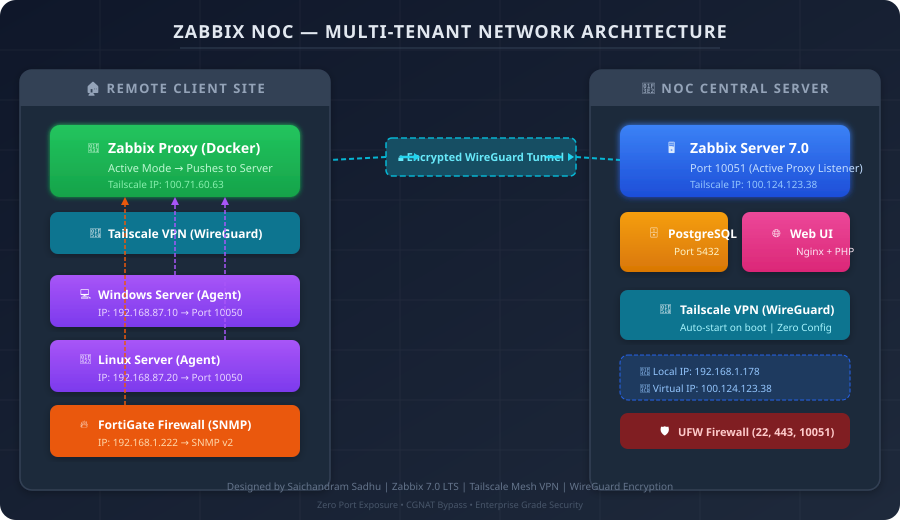
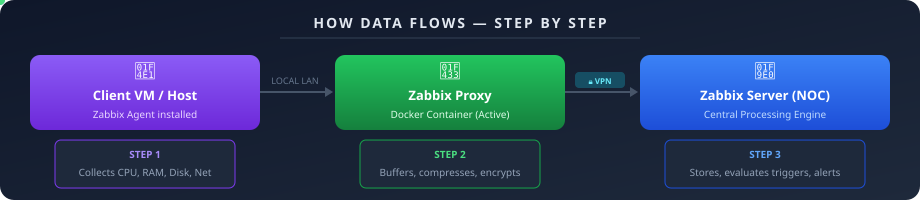
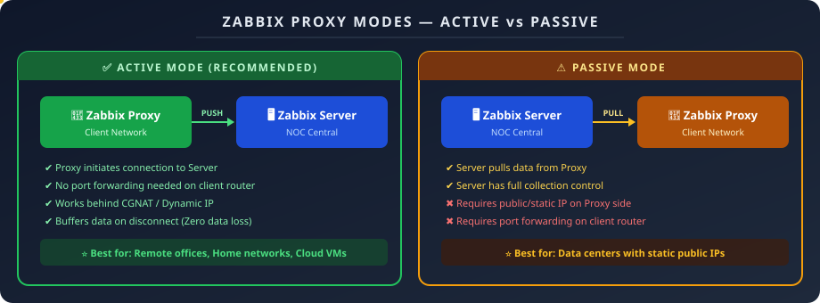
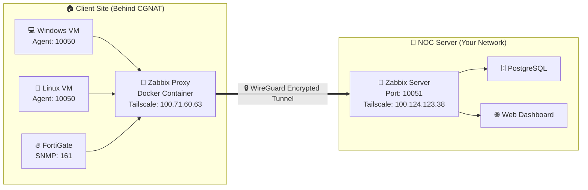

<div align="center">

# 🖥️ Zabbix NOC — Multi-Tenant Enterprise Monitoring Platform

[](https://www.zabbix.com/)
[](https://www.docker.com/)
[](https://www.postgresql.org/)
[](https://tailscale.com/)
[](https://nginx.org/)
[](LICENSE)

**Production-grade, fully dockerized Zabbix 7.0 monitoring stack with a custom MSP (Multi-Tenant) Companies Management Module, secure Tailscale VPN proxy routing, and enterprise-level hardening — all deployable in a single command.**

> 🚀 **Project Architect & Author:** [Saichandram Sadhu](https://github.com/saichandram-sadhu)

---

</div>

## 📐 Network Architecture — Full Topology

<div align="center">
  
</div>

---

## 🧠 What is Zabbix? (A-to-Z Explanation)

### The Problem It Solves
Imagine you manage **50+ servers, switches, and firewalls** across multiple client offices. Without monitoring:
- ❌ You won't know if a server's disk is 95% full until it crashes
- ❌ You won't know if a client's internet went down until they call you
- ❌ You won't know if CPU usage has been spiking for hours

**Zabbix solves all of this.** It continuously monitors every device's health metrics (CPU, RAM, Disk, Network, Services) and **instantly alerts you** via email, Telegram, or SMS when something goes wrong — even before the client notices.

### Core Components

| Component | Role | Icon |
|---|---|---|
| **Zabbix Server** | The central brain. Collects all metrics, evaluates triggers, sends alerts | 🧠 |
| **Zabbix Proxy** | A local relay agent deployed at each client site. Collects data locally and pushes to the server | 🔁 |
| **Zabbix Agent** | A small service installed on each monitored machine (Windows/Linux). Reports metrics to the Proxy or Server | 📡 |
| **Zabbix Web UI** | A beautiful web dashboard (Nginx + PHP) where you view graphs, alerts, maps and configure everything | 🌐 |
| **PostgreSQL** | The database storing all configuration, history, and trend data | 🗄️ |

### How Data Flows (Step-by-Step)

<div align="center">
  
</div>

---

## ⚡ 1-Click Quick Start (Linux)

### Prerequisites
- [Docker Engine](https://docs.docker.com/engine/install/) installed
- [Docker Compose](https://docs.docker.com/compose/install/) v2+ installed
- Minimum **2 GB RAM** and **20 GB Disk** available

### Launch

```bash
# 1. Clone the repository
git clone https://github.com/saichandram-sadhu/Zabbix.git
cd Zabbix

# 2. Start the entire stack (Server + Database + Web UI + Agent)
docker compose up -d

# 3. Verify all containers are running
docker compose ps
```

### Access the Dashboard

| Service | Access Method | Credentials |
|---|---|---|
| 🌐 **Zabbix Web UI** | Browser → `http://localhost` | Username: `Admin` / Password: `zabbix` |
| 🗄️ **PostgreSQL** | ⚠️ Database Client only (NOT a browser URL!) → `localhost:5432` | User: `zabbix` / Password: `StrongPassword@123` |

> **⚠️ Important:** PostgreSQL is a database service — it **cannot** be opened in a web browser! Use `psql` (terminal) or **pgAdmin** (GUI tool) instead. See the [PostgreSQL Management Guide](#%EF%B8%8F-postgresql-database-management-complete-guide) below for details.

### Enable the Custom Companies Module
1. Log in to Zabbix Web UI
2. Navigate to **`Administration`** → **`General`** → **`Modules`**
3. Click **`Scan directory`**
4. Enable **`Companies Management`** module
5. Access it from the left sidebar menu ✅

---

## 🪟 Installing Zabbix on Windows Server (Full Step-by-Step Guide)

To deploy the Zabbix Server on Windows Server (2019/2022/2025), follow every step below carefully. Do not skip any step!

<details>
<summary><b>📌 Step 1: Enable Windows Features (Hyper-V & WSL2)</b></summary>

Docker Desktop requires **WSL2 (Windows Subsystem for Linux 2)** or the **Hyper-V** backend to run containers.

**Open PowerShell as Administrator** (Start → search "PowerShell" → Right-click → Run as Administrator):

```powershell
# Enable WSL feature
dism.exe /online /enable-feature /featurename:Microsoft-Windows-Subsystem-Linux /all /norestart

# Enable Virtual Machine Platform
dism.exe /online /enable-feature /featurename:VirtualMachinePlatform /all /norestart
```

**⚠️ RESTART your system now!** (This is mandatory — do not proceed without restarting)

After restart, open PowerShell (Admin) again:
```powershell
# Set WSL2 as the default version
wsl --set-default-version 2

# Update the WSL2 Linux kernel
wsl --update
```

</details>

<details>
<summary><b>📌 Step 2: Install Docker Desktop</b></summary>

1. Open the following link in your browser:
   👉 [https://www.docker.com/products/docker-desktop/](https://www.docker.com/products/docker-desktop/)

2. Click the **"Download for Windows"** button

3. Once downloaded, double-click the `.exe` file to launch the installer

4. In the installation wizard:
   - ✅ Keep **"Use WSL 2 instead of Hyper-V"** checkbox **enabled**
   - ✅ Check **"Add shortcut to desktop"**
   - Click **Ok** / **Install**

5. After installation completes, click **"Close and restart"**

6. After restart, Docker Desktop will start automatically. You'll see the 🐳 whale icon in the taskbar (bottom-right)

7. **Verify the installation** — Open PowerShell and run:
   ```powershell
   docker --version
   # Expected output: Docker version 27.x.x, build xxxxx ✅

   docker compose version
   # Expected output: Docker Compose version v2.x.x ✅
   ```

> **⚠️ If you see a "Docker Desktop - WSL2 backend" error:**
> Open Docker Desktop → Settings → General → ✅ Enable "Use the WSL 2 based engine" → Apply & Restart

</details>

<details>
<summary><b>📌 Step 3: Install Git for Windows</b></summary>

1. Open the following link in your browser:
   👉 [https://git-scm.com/download/win](https://git-scm.com/download/win)

2. Click **"64-bit Git for Windows Setup"** to download

3. Double-click the `.exe` file to install:
   - Keep all settings at their **defaults** (Next → Next → Next → Install)
   - **Important**: On the "Adjusting your PATH" screen, ensure **"Git from the command line and also from 3rd-party software"** is selected

4. **Verify** — Open a **new** PowerShell window:
   ```powershell
   git --version
   # Expected output: git version 2.x.x.windows.x ✅
   ```

</details>

<details>
<summary><b>📌 Step 4: Clone the Repository & Start Zabbix</b></summary>

Open PowerShell and run the following commands:

```powershell
# Navigate to your preferred directory
cd C:\Users\Administrator\Desktop

# Clone the repository
git clone https://github.com/saichandram-sadhu/Zabbix.git

# Enter the project directory
cd Zabbix

# Start the entire Zabbix stack using Docker Compose
docker compose up -d
```

**The first launch may take 3-5 minutes** as Docker downloads the required images (~500 MB).

Check the progress:
```powershell
# Verify all containers are running
docker compose ps

# Expected output:
# NAME            STATUS
# zabbix-db       running (healthy)
# zabbix-server   running
# zabbix-web      running
# zabbix-agent    running
```

> **⚠️ If `zabbix-server` is in a restart loop:**
> Wait 1-2 minutes — database initialization takes time on the first run.
> Check logs: `docker compose logs zabbix-server`

</details>

<details>
<summary><b>📌 Step 5: Access the Zabbix Web UI</b></summary>

1. Open your browser (Chrome / Firefox / Edge)

2. Navigate to:
   ```
   http://localhost
   ```

3. The Zabbix Login Page will appear:
   - **Username:** `Admin` (capital A)
   - **Password:** `zabbix`

4. 🎉 **Congratulations! Your Zabbix Server is running on Windows!**

> **⚠️ If you see "This site can't be reached":**
> - Verify Docker Desktop is running (check for the 🐳 icon in the taskbar)
> - Wait 2 minutes for the containers to fully initialize
> - Run `docker compose ps` to check the container status

</details>

<details>
<summary><b>📌 Step 6: Configure Windows Firewall (For Remote Access)</b></summary>

To access the Zabbix Server from other computers on your network, allow the required ports through Windows Firewall:

```powershell
# Run in PowerShell (Administrator):

# Zabbix Web UI (HTTP)
netsh advfirewall firewall add rule name="Zabbix Web HTTP" dir=in action=allow protocol=tcp localport=80

# Zabbix Web UI (HTTPS)
netsh advfirewall firewall add rule name="Zabbix Web HTTPS" dir=in action=allow protocol=tcp localport=443

# Zabbix Server (Proxy connections)
netsh advfirewall firewall add rule name="Zabbix Server Trapper" dir=in action=allow protocol=tcp localport=10051
```

You can now access Zabbix from any other computer on the network:
```
http://<windows-server-ip>
```

</details>

<details>
<summary><b>📌 Step 7: Configure Auto-Start on Boot</b></summary>

To ensure Zabbix starts automatically when Windows Server reboots:

1. Open **Docker Desktop Settings** (right-click the 🐳 icon in the taskbar → Settings)
2. Under the **General** tab:
   - ✅ Enable **"Start Docker Desktop when you sign in to Windows"**
3. Click **Apply & Restart**

The `docker-compose.yml` already includes `restart: unless-stopped` for all containers, so they will start automatically once Docker Desktop launches.

**Verify auto-start:**
```powershell
# Restart the server
Restart-Computer

# After restart, open PowerShell and check
docker compose ps
# All containers should show "running" status ✅
```

</details>

<details>
<summary><b>🔧 Troubleshooting: Common Windows Errors & Solutions</b></summary>

| Error | Solution |
|---|---|
| `docker: command not found` | Docker Desktop is not installed or requires a restart |
| `WSL 2 installation is incomplete` | Follow Step 1 — run `wsl --update` |
| `port is already allocated` | IIS or another service is using port 80 → Stop IIS: `iisreset /stop` |
| `zabbix-server keeps restarting` | Database initialization takes time — wait 2-3 minutes |
| `Cannot connect to Docker daemon` | Start Docker Desktop (check for 🐳 icon in taskbar) |
| `image not found / pull access denied` | Check your internet connection |
| `Hyper-V is not enabled` | Run the dism commands from Step 1 and restart |
| Web UI shows blank page | Check logs: `docker compose logs zabbix-web` |

</details>

---

## 🔄 Zabbix Proxy — Active vs Passive Modes

<div align="center">
  
</div>

### Detailed Comparison

| Feature | 🟢 Active Proxy (Recommended) | 🟡 Passive Proxy |
|---|---|---|
| **Connection Direction** | Proxy → Server (Proxy initiates) | Server → Proxy (Server initiates) |
| **Port Forwarding** | ❌ Not required on client router | ✅ Required on client router |
| **Works behind CGNAT** | ✅ Yes | ❌ No |
| **Works with Dynamic IP** | ✅ Yes | ❌ No (needs Static IP) |
| **Data Buffering** | ✅ Buffers locally if connection drops | ❌ Server retries until timeout |
| **Best For** | Remote offices, Home labs, Cloud | Data centers with static public IPs |

### Why We Use Active Mode
In many countries, home broadband ISPs (e.g., GTPL, Jio, Airtel) use **CGNAT (Carrier-Grade NAT)**. This means:
- Your router does NOT get a real public IP address
- Port forwarding simply doesn't work (even if configured correctly on the router)
- The solution: **Active Proxy + Tailscale VPN** = Zero port exposure, zero router configuration needed

---

## 🔐 Security Hardening Guide

### Step 1: Change Database Password

Open `docker-compose.yml` and replace `StrongPassword@123` in **all three services**:

```yaml
# Update in zabbix-db, zabbix-server, AND zabbix-web:
environment:
  - POSTGRES_PASSWORD=YourNewSecureDBPassword
```

Apply the changes:
```bash
docker compose down && docker compose up -d
```

### Step 2: Change Zabbix Admin Password
1. Login to Zabbix Web UI → **`Users`** → **`Admin`**
2. Click **`Change password`** → Enter your new password → Click **`Update`**

### Step 3: Enable Multi-Factor Authentication (MFA)
1. Go to **`Administration`** → **`Authentication`** → **`MFA Settings`**
2. Add a TOTP provider (Google Authenticator / Authy)
3. Enforce MFA on the `Zabbix administrators` group

### Step 4: Firewall Configuration (Linux)
```bash
# Allow only essential ports
sudo ufw allow 22/tcp      # SSH
sudo ufw allow 443/tcp     # HTTPS
sudo ufw allow 10051/tcp   # Zabbix Server
sudo ufw enable
```

### Step 5: Fail2Ban (Brute Force Protection)
```bash
sudo apt install fail2ban -y
sudo systemctl enable fail2ban
sudo systemctl start fail2ban
```

### Step 6: Web Server Security Headers
Add these headers to your Apache/Nginx configuration:
```
Header always set Strict-Transport-Security "max-age=31536000; includeSubDomains"
Header always set X-Content-Type-Options "nosniff"
Header always set X-Frame-Options "SAMEORIGIN"
Header always set Referrer-Policy "strict-origin-when-cross-origin"
ServerTokens Prod
ServerSignature Off
```

---

## 🗄️ PostgreSQL Database Management (Complete Guide)

> **⚠️ PostgreSQL is a database service — it CANNOT be opened in a web browser!**
> Browsers only render HTTP/HTTPS pages. PostgreSQL uses its own binary protocol on port 5432. You need dedicated database client tools to access it.

### Method 1: Terminal Access (psql — Command Line)

For quick queries, use the PostgreSQL CLI client:
```bash
# Connect to the Zabbix database
PGPASSWORD=StrongPassword@123 psql -h localhost -U zabbix -d zabbix

# Once connected, you can run SQL queries:
# SELECT * FROM hosts LIMIT 5;
# \dt   (list all tables)
# \q    (exit)
```

### Method 2: pgAdmin 4 (Web GUI — Recommended for Beginners)

pgAdmin is a web-based graphical tool for managing PostgreSQL databases — browse tables, write queries, take backups, all with a visual interface.

<details>
<summary><b>📌 Step 1: Install pgAdmin (Ubuntu/Debian)</b></summary>

```bash
# Add the pgAdmin repository
curl -fsS https://www.pgadmin.org/static/packages_pgadmin_org.pub | sudo gpg --dearmor -o /usr/share/keyrings/packages-pgadmin-org.gpg

sudo sh -c 'echo "deb [signed-by=/usr/share/keyrings/packages-pgadmin-org.gpg] https://ftp.postgresql.org/pub/pgadmin/pgadmin4/apt/$(lsb_release -cs) pgadmin4 main" > /etc/apt/sources.list.d/pgadmin4.list'

sudo apt update

# Install pgAdmin in web mode (accessible via browser)
sudo apt install pgadmin4-web -y

# Run the setup script (set your login email and password)
sudo /usr/pgadmin4/bin/setup-web.sh
```
During setup, you'll be prompted to provide:
- **Email**: Enter your admin email (e.g., `admin@zabbix.local`)
- **Password**: Set a login password for pgAdmin

</details>

<details>
<summary><b>📌 Step 2: Open pgAdmin</b></summary>

Open your browser and navigate to:
```
http://localhost/pgadmin4
```
If Zabbix Web is already running on port 80, use an alternate port:
```
http://localhost:5050
```

Log in with the email and password you set during the setup step.

</details>

<details>
<summary><b>📌 Step 3: Connect to the Zabbix Database</b></summary>

1. In pgAdmin, right-click **`Servers`** in the left panel → **`Register`** → **`Server`**
2. Under the **General** tab:
   - **Name**: `Zabbix Database`
3. Under the **Connection** tab, enter the following values:

| Field | Value |
|---|---|
| Host name/address | `localhost` |
| Port | `5432` |
| Maintenance database | `zabbix` |
| Username | `zabbix` |
| Password | `StrongPassword@123` |

4. ✅ Enable the **Save password** checkbox
5. Click **Save** — Connected! 🎉

You can now expand `Zabbix Database` → `Databases` → `zabbix` → `Schemas` → `public` → `Tables` in the left panel to browse all Zabbix tables.

</details>

### Method 3: DBeaver (Desktop GUI — Cross-Platform)

<details>
<summary><b>📌 DBeaver Install & Connect (Windows/Mac/Linux)</b></summary>

#### Installing on Linux (3 Options):

**Option A: Install via Snap (Easiest — Ubuntu/Debian):**
```bash
sudo snap install dbeaver-ce
```
After installation, launch by typing `dbeaver-ce` in the terminal or from the Application Menu.

**Option B: Install via APT (Ubuntu/Debian — Official Repository):**
```bash
# Add the DBeaver GPG key
curl -fsSL https://dbeaver.io/debs/dbeaver.gpg.key | sudo gpg --dearmor -o /usr/share/keyrings/dbeaver.gpg

# Add the repository
echo "deb [signed-by=/usr/share/keyrings/dbeaver.gpg] https://dbeaver.io/debs/dbeaver-ce /" | sudo tee /etc/apt/sources.list.d/dbeaver.list

# Install DBeaver
sudo apt update && sudo apt install dbeaver-ce -y
```

**Option C: Install via .deb file (Manual Download):**
```bash
# Download the latest .deb package
wget https://dbeaver.io/files/dbeaver-ce_latest_amd64.deb

# Install the package
sudo dpkg -i dbeaver-ce_latest_amd64.deb

# Fix any dependency errors
sudo apt install -f -y
```

#### Installing on Windows:
1. Visit [https://dbeaver.io/download/](https://dbeaver.io/download/)
2. Click the **Windows (installer)** download button
3. Run the downloaded `.exe` file → Follow the wizard: Next → Next → Install

#### Installing on Mac:
```bash
brew install --cask dbeaver-community
```
Alternatively, download the `.dmg` file from the [DBeaver website](https://dbeaver.io/download/) and install it manually.

---

#### Connecting DBeaver to the Zabbix Database:
1. Open DBeaver
2. Click the **`New Database Connection`** button (plug icon 🔌) in the top-left
3. Search for **`PostgreSQL`** → Select it → Click **Next**
4. Fill in the connection settings:

| Field | Value |
|---|---|
| Host | `localhost` (or your server's IP, e.g., `192.168.1.178`) |
| Port | `5432` |
| Database | `zabbix` |
| Username | `zabbix` |
| Password | `StrongPassword@123` |

5. Click **Test Connection**
   - On the first attempt, DBeaver will prompt you to download the PostgreSQL JDBC driver → Click **Download**
   - After the driver installs, you should see a "Connected" success message ✅
6. Click **Finish** — Done! 🎉

You can now browse all Zabbix tables by expanding `zabbix` → `Schemas` → `public` → `Tables` in the left panel.

</details>

### How to Change the Database Password (Step-by-Step)

> **⚠️ WARNING:** When changing the database password, you must also update the Zabbix Server and Web UI configurations — otherwise, the database connection will break!

**Step 1:** Change the password directly in PostgreSQL:
```bash
PGPASSWORD=StrongPassword@123 psql -h localhost -U zabbix -d zabbix -c "ALTER USER zabbix WITH PASSWORD 'YourNewSecurePassword';"
```

**Step 2:** Update `docker-compose.yml` — replace the old password in **all three services**:
```yaml
# In the zabbix-db service:
- POSTGRES_PASSWORD=YourNewSecurePassword

# In the zabbix-server service:
- POSTGRES_PASSWORD=YourNewSecurePassword

# In the zabbix-web service:
- POSTGRES_PASSWORD=YourNewSecurePassword
```

**Step 3:** Restart the stack:
```bash
docker compose down && docker compose up -d
```

**Step 4:** Verify the connection:
```bash
# Test database connectivity
PGPASSWORD=YourNewSecurePassword psql -h localhost -U zabbix -d zabbix -c "SELECT version();"

# Also verify the Zabbix Web UI loads correctly in your browser
```

---

## 🌐 Remote Client Setup (Tailscale CGNAT Bypass)

### What is Tailscale?
Tailscale creates a **private encrypted mesh network** between your devices using the **WireGuard protocol**. Each device gets a permanent virtual IP (`100.x.x.x`) that never changes — even if your real internet IP changes.

### Architecture with Tailscale



### Setup Steps

<details>
<summary><b>📌 Step 1: Install Tailscale on the Zabbix Server VM</b></summary>

```bash
# Download and install Tailscale
curl -fsSL https://tailscale.com/install.sh | sh

# Start the service and authenticate (a browser link will be generated)
sudo tailscale up --accept-dns=false

# Note your assigned virtual IP
tailscale ip -4
# Example output: 100.124.123.38
```
</details>

<details>
<summary><b>📌 Step 2: Install Tailscale on the Client's Proxy VM</b></summary>

```bash
# Download and install Tailscale
curl -fsSL https://tailscale.com/install.sh | sh

# Start and authenticate (use the SAME Tailscale account as the server)
sudo tailscale up --accept-dns=false

# Note your assigned virtual IP
tailscale ip -4
# Example output: 100.71.60.63
```
</details>

<details>
<summary><b>📌 Step 3: Test the Connection</b></summary>

```bash
# From the Proxy VM, ping the Server's Tailscale IP
ping 100.124.123.38

# Expected: Replies received = Connection established ✅
```
</details>

<details>
<summary><b>📌 Step 4: Launch the Zabbix Proxy Container</b></summary>

```bash
docker run --name zabbix-proxy -d \
  -e ZBX_SERVER_HOST="100.124.123.38" \
  -e ZBX_HOSTNAME="Proxy_Clientbeta" \
  --net=host \
  --restart unless-stopped \
  zabbix/zabbix-proxy-sqlite3:alpine-7.0-latest
```
</details>

<details>
<summary><b>📌 Step 5: Configure Zabbix Agents on Client VMs</b></summary>

Edit `zabbix_agentd.conf` on each monitored machine:
```ini
# Point to the local Proxy VM's IP (NOT the Tailscale IP)
Server=192.168.87.20
ServerActive=192.168.87.20

# Must match the host name configured in the Zabbix Frontend
Hostname=Windows_Server_ClientBeta
```

Restart the agent service:
```bash
# Linux
sudo systemctl restart zabbix-agent

# Windows (Run as Administrator)
net stop "Zabbix Agent" && net start "Zabbix Agent"
```
</details>

<details>
<summary><b>📌 Step 6: Register the Proxy in the Zabbix Server</b></summary>

1. Login to the Zabbix Web UI
2. Go to **`Administration`** → **`Proxies`**
3. Click **`Create proxy`**
4. Configure:
   - **Proxy name:** `Proxy_Clientbeta` (must match `ZBX_HOSTNAME` exactly)
   - **Proxy mode:** `Active`
5. Click **`Add`**
6. Wait 1-2 minutes — the status will turn **🟢 Green (Online)** ✅
</details>

---

## 🛠️ NOC Hardening & Alert Customizations by Saichandram Sadhu

This production environment has been highly customized and hardened by **Saichandram Sadhu** to establish a state-of-the-art NOC Monitoring standard. The customizations focus on security, clear alert visibility, and eliminating false positives:

### 1. 🚨 High-Priority Offline & Availability Alerts
Standard Zabbix triggers have been renamed and escalated to **High Severity (Red)** to capture immediate attention in the NOC:
- **Zabbix Agent Disconnect**: Triggers are renamed to `🚨 Zabbix Agent Offline: Host {HOST.NAME} is disconnected or Zabbix service is stopped!`
- **Network Ping Failure**: Triggers are renamed to `🚨 Network Ping Failure: Host {HOST.NAME} is completely unreachable!`
- **Link Down Alerts**: Triggers are renamed to `🚨 CRITICAL Link Down! Interface {#IFNAME} on {HOST.NAME} is down!`

### 2. 🗄️ Advanced Filesystem (Disk Space) Alerts
Trigger prototypes on the template level have been redesigned to make storage warnings clear and intuitive across all discovered drives (C:, D:, E:, etc.):
- **Warning Threshold**: Redesigned to `⚠️ Drive [{#FSNAME}] is filling up (Space Low)` (Severity: Average, triggered above 85% utilization).
- **Critical Threshold**: Redesigned to `🚨 Drive [{#FSNAME}] is almost FULL (Space Critically Low)` (Severity: High, triggered above 95% utilization).
- **False Positive Elimination**: Configured Zabbix macros globally so alerts only trigger if both the percentage threshold is breached AND the absolute free space falls below a minimum threshold (`5GB` for Warning, `2GB` for Critical).

### 🔌 3. Interface Alert Hardening (Zero False-Positives)
To eliminate standard Zabbix noise where every dynamic interface status change (like a user shutting down their computer) triggers a warning:
- The global macro `{$IFCONTROL}` is set to `0`. This disables link-down triggers for all discovered interfaces on all hosts by default.
- Host-level overrides (`{$IFCONTROL:"<interface-name>"} = 1`) are configured on critical ports (e.g., `port1`/`port2` on Firewalls/Switches, and `Ethernet0` on Windows Servers). Link-down alerts will **only** trigger on these specified critical links.

<details>
<summary><b>📖 Step-by-Step: How to Enable Alerting for Critical Interfaces on Future Devices</b></summary>

When you add a new network switch, firewall, or server, Zabbix dynamically discovers all network interfaces. By default, **no link-down alerts will trigger** (zero noise setup). To enable alert notifications for only the critical ports (uplinks, WAN links, trunk ports), follow this simple procedure:

#### Step 1: Identify the exact Interface Name
1. Log in to the Zabbix Web UI.
2. Go to **`Monitoring`** → **`Hosts`** (or **`Data collection`** → **`Hosts`**).
3. Find your new host, and click on its **`Items`**.
4. Look for the discovered interface name (e.g. `WAN1`, `port1`, `Ethernet0`, or `GigabitEthernet1/0/24`). Ensure you copy the **exact name** of the port.

#### Step 2: Configure the Host Override Macro
1. Go to **`Data collection`** → **`Hosts`** and click on your target host name.
2. Navigate to the **`Macros`** tab.
3. Under **`Inherited and host macros`** (or **`Host macros`**), click **`Add`**.
4. Define the macro and value as follows:

| Macro | Value | Description |
|---|---|---|
| `{$IFCONTROL:"<interface-name>"}` | `1` | Replace `<interface-name>` with your exact port name (e.g. `{$IFCONTROL:"WAN1"}`) |

*Example values:*
- For a new Firewall uplink: `{$IFCONTROL:"WAN1"}` → `1`
- For a critical Switch trunk port: `{$IFCONTROL:"GigabitEthernet1/0/24"}` → `1`
- For a second server NIC: `{$IFCONTROL:"Ethernet 2"}` → `1`

5. Click **`Update`** (or **`Add`**) to save the configuration.

#### How it works:
Zabbix's interface discovery templates use the check `{$IFCONTROL:"{#IFNAME}"}=1` to determine whether to enable the trigger. Since the global `{$IFCONTROL}` macro is set to `0`, Zabbix checks:
- If a host macro `{$IFCONTROL:"{#IFNAME}"}` exists, it overrides the global default and evaluates to `1` (Alarms Enabled ✅).
- If it does not exist, it falls back to the global `{$IFCONTROL} = 0` (Alarms Blocked ❌).

</details>

### 🛡️ 4. Server Security Hardening Summary
- **UFW Firewall**: Blocked all ports except HTTP/S (80/443), Trapper (10051), and SSH (22).
- **Brute Force Protection**: Implemented `fail2ban` for automated blocking of SSH brute-force attackers.
- **Credential Protection**: Hardened all PostgreSQL database passwords and default Admin credentials.
- **Guest Access Disabled**: Guest user access to the frontend is completely blocked (`gui_access = 2`).
- **Secure Sessions**: Configured HTTPS redirect and enforced `Secure` & `HttpOnly` flags on PHP session cookies.

### 🗺️ 5. NOC Dashboard & Geographical Maps (Fixed & Upgraded)
To fix and upgrade the global overview interface for NOC operators:
- **Geomap Coordinates & Tiles Fixed**: Set explicit latitude and longitude coordinates for all hosts globally via API, plotting them accurately on the India-wide Geomap (Delhi, Ahmedabad, Surat, Mumbai). Updated the global tile provider to **CartoDB Positron CDN** (instead of standard OpenStreetMap) to bypass mixed-content and browser user-agent blocks, resolving the grey blank map issue.
- **Secondary Dashboard Tab**: Created a new **"Network Topology Map"** page on the Global View dashboard, embedding the live local network connectivity map showing real-time host status.
- **MSP Clients Dashboard — Per-Tenant Widgets**: Added **Problems by Severity** widget to each tenant page (ClientAlpha, ClientBeta) in the MSP Clients Dashboard, matching the Global dashboard's layout. Each client page now shows: Host Availability | Problems by Severity | Host Metrics | Problem Hosts | Web Monitoring | Active Alerts — all filtered to the tenant's host group.

---

## 🏢 Custom Companies Management Module

This repository includes a custom PHP module (`companies/`) that adds **MSP (Managed Service Provider) multi-tenant management** capabilities to Zabbix:

### Features
| Feature | Description |
|---|---|
| 📊 **Interactive KPI Dashboard** | Clickable summary cards showing Host Groups, Users, Connected Hosts count |
| 🔗 **Deep Linking** | KPI cards link directly to native Zabbix configuration pages |
| 👤 **User Badges** | Click any user badge to open their Zabbix profile |
| ⚡ **Live Alerts Panel** | Real-time problems panel linked to trigger event details |
| 🎨 **Modern CSS** | Hover transitions, gradient cards, responsive grid layout |
| 🌐 **Interactive NOC Topology** | Dynamic auto-generated tree graph (using Vis.js) mapping Zabbix Server, Active Proxies, and Monitored Hosts with real IP discovery and live alert state color glows. Features pan, click, drag, search, and zoom controls |

### Module Files
```
companies/
├── Module.php                          # Module registration & menu entries
├── manifest.json                       # Module metadata & version
├── actions/
│   ├── CompaniesListAction.php         # Main controller (data fetching)
│   ├── CompaniesTopologyAction.php     # Network topology data mapper
│   ├── CompaniesCreateAction.php       # Company creation handler
│   └── CompaniesDeleteAction.php       # Company deletion handler
└── views/
    └── companies.list.php              # Frontend view (HTML + CSS + JS)
```

---

## 🗂️ Project Structure

```
Zabbix/
├── 📄 README.md                    # This documentation
├── 🐳 docker-compose.yml           # 1-click deployment stack
├── 📊 network_flow.svg             # Network architecture diagram
├── 📊 proxy_modes.svg              # Proxy modes comparison diagram
├── 📊 data_flow.svg                # Data flow pipeline diagram
├── 📝 create_dashboard.py          # Python script for dashboard automation
├── 📝 manage_tenants.py            # Python script for tenant management
├── 📁 companies/                   # Custom MSP module (auto-mounted)
│   ├── Module.php
│   ├── manifest.json
│   ├── actions/
│   └── views/
└── 📄 Zabbix_Monitoring_Report.docx # Project documentation report
```

---

## 📋 Quick Reference — Important Ports

| Port | Protocol | Service | Direction |
|---|---|---|---|
| `10051` | TCP | Zabbix Server (Trapper) | Proxy → Server |
| `10050` | TCP | Zabbix Agent | Server/Proxy → Agent |
| `443` | TCP | HTTPS Web UI | Browser → Server |
| `5432` | TCP | PostgreSQL Database | Internal only |
| `161` | UDP | SNMP (Switches/Firewalls) | Proxy → Device |
| `41641` | UDP | Tailscale/WireGuard | Mesh (auto-configured) |

---

## ❓ Frequently Asked Questions

<details>
<summary><b>Q: Is Tailscale free forever?</b></summary>

**Yes!** Tailscale's Personal plan is free forever. You get **100 devices** and **3 users** at no cost. The virtual IPs are permanent and never change.
</details>

<details>
<summary><b>Q: Does Tailscale auto-start after a server reboot?</b></summary>

**Yes!** Upon installation, Tailscale registers itself as a systemd service (`tailscaled.service`). It will automatically reconnect after every boot. Verify with: `systemctl is-enabled tailscaled` → `enabled`
</details>

<details>
<summary><b>Q: Will data be lost if the internet disconnects?</b></summary>

**No!** The Active Proxy buffers all collected data in its local SQLite database. Once internet connectivity is restored, the buffered data is automatically pushed to the server. **Zero data loss.**
</details>

<details>
<summary><b>Q: How many Proxies can connect to a single Zabbix Server?</b></summary>

**Unlimited.** There is no hard limit on the number of proxies a Zabbix Server can handle. You can easily monitor 100+ client sites from a single server — just scale your RAM and CPU accordingly.
</details>

<details>
<summary><b>Q: Is my personal data uploaded to GitHub?</b></summary>

**No!** Database data (stored in the `zabbix-db-storage` Docker volume) is not included in the Git repository. Only configuration files, module code, and documentation are pushed. Anyone who clones this repository will get a fresh, empty Zabbix environment.
</details>

---

## 🛜 Headscale Self-Hosted Mesh VPN (NOC VPN) Setup Guide

This repository contains a pre-configured **Headscale** server and **Headplane UI** stack inside the `headscale/` directory. By deploying this stack, you can securely connect Zabbix Proxies and client hosts to your Zabbix Server over an encrypted peer-to-peer mesh network without ports forwarding or public static IPs.

### 📋 Prerequisites & Port Requirements
- **Docker** and **Docker Compose** installed on the server host.
- Open these ports on your Zabbix Server's external firewall:
  - `8080/tcp`: Headscale control server API (incoming from proxies/clients).
  - `8081/tcp`: Headplane UI (web management console).
  - `41641/udp`: Tailscale WireGuard data traffic port (allows direct peer-to-peer pathing).

---

### 🚀 Step-by-Step Server Host Setup

#### Step 1: Start the VPN Stack
Navigate to the `headscale` directory inside the repository (on your server host, this is located at `/home/saichandram/headscale/`) and run the start command:
```bash
# Go to the headscale compose directory
cd /home/saichandram/headscale

# Spin up the containers in the background
docker compose up -d
```
Verify both containers are running and healthy:
```bash
docker ps
```
*(You should see `headscale` listening on `8080` and `headplane` listening on `8081`.)*

---

#### Step 2: Create a Namespace User
Headscale groups all devices inside namespaces (users). Create the default namespace `noc-network`:
```bash
docker exec headscale headscale users create noc-network
```

---

#### Step 3: Log in to the Web Console (Headplane UI)
To manage the network visually, you must connect the Web UI to the Headscale API:

1. **Generate the Web API Key**:
   ```bash
   docker exec headscale headscale apikeys create
   ```
   *(Copy the generated key beginning with `hskey-api-...`)*
2. **Access the Console**: Open **`http://<SERVER_PUBLIC_IP>:8081/admin`** in your browser.
3. **Configure Settings**:
   - **Headscale URL**: Input `http://<SERVER_PUBLIC_IP>:8080`
   - **API Key**: Paste the key generated in the previous step.
4. Click **Save API Key** to open the Tailscale-style machines console.

---

#### Step 4: Generate a Reusable Pre-authorized Key (Auth Key)
To prevent the manual "copy registration link" step when installing client proxies, you can generate a **reusable pre-auth key**.

> [!IMPORTANT]
> **Version Constraint**: In Headscale `v0.29.x`+, the `-u` or `--user` flag **strictly requires the numeric User ID**, not the string name.

1. **Find the numeric User ID** of `noc-network`:
   ```bash
   docker exec headscale headscale users list
   ```
   *(Look at the ID column for `noc-network`, e.g., `1`)*
2. **Create the Key** (using the numeric ID):
   ```bash
   # Reusable key valid for 180 days:
   docker exec headscale headscale preauthkeys create --user 1 --reusable --expiration 180d
   ```
   *(Copy the generated key starting with `hskey-auth-...`)*

---

### 💻 Connecting Clients & Zabbix Proxies

#### Step 5: Install & Connect Zabbix Proxy Nodes
On each remote Zabbix Proxy machine (Ubuntu/Linux), run these commands:

1. **Install Tailscale**:
   ```bash
   curl -fsSL https://tailscale.com/install.sh | sh
   ```
2. **Join the network automatically** (Zero-Touch Setup):
   ```bash
   sudo tailscale up --login-server http://<SERVER_PUBLIC_IP>:8080 --auth-key hskey-auth-<YOUR_PRE_AUTH_KEY> --accept-dns=false
   ```
   *(Replace `<SERVER_PUBLIC_IP>` with Zabbix Server IP, and `<YOUR_PRE_AUTH_KEY>` with the key generated in Step 4.)*
3. **Verify IP allocation**:
   ```bash
   tailscale ip -4
   ```
   *(The client proxy will show its permanent VPN IP, e.g., `100.64.0.1`)*

---

#### Step 6: Connect Zabbix Server Host itself
To allow the Zabbix Server to talk to the proxies over the VPN, the server host must also join:

1. **Logout of any existing Tailscale network**:
   ```bash
   sudo tailscale logout
   ```
2. **Join the local Headscale network**:
   ```bash
   sudo tailscale up --login-server http://192.168.1.178:8080 --auth-key hskey-auth-<YOUR_PRE_AUTH_KEY> --accept-dns=false --force-reauth
   ```
3. Verify connection by pinging the proxy's IP from the server:
   ```bash
   ping -c 3 100.64.0.1
   ```

---

### ⚙️ Zabbix Proxy Configuration under VPN Mesh

Once both the Zabbix Server and Zabbix Proxy are connected to the VPN:
- Zabbix Server VPN IP: `100.64.0.2`
- Zabbix Proxy VPN IP: `100.64.0.1`

#### A. If running Zabbix Proxy via Docker Compose:
In the remote proxy's `docker-compose.yml`, direct the database sync to the Zabbix Server's VPN IP:
```yaml
services:
  zabbix-proxy:
    image: zabbix/zabbix-proxy-sqlite3:alpine-7.0-latest
    environment:
      - ZBX_SERVER_HOST=100.64.0.2  # Point directly to Zabbix Server VPN IP
```

#### B. If running Zabbix Proxy natively:
Edit `/etc/zabbix/zabbix_proxy.conf` on the remote proxy machine:
```ini
Server=100.64.0.2  # Point to Zabbix Server VPN IP
```

#### C. In Zabbix Server Web UI:
1. Go to **Administration** -> **Proxies** and click **Create Proxy** (or edit existing).
2. Set the **Proxy Address** or **Interface IP** to the Proxy's VPN IP: `100.64.0.1`.
3. Save. Data synchronization will now securely route through the encrypted WireGuard tunnel.

---

## 🛡️ Backup & Disaster Recovery (Local, Hardware & Cloud)

We have built an automated backup pipeline that packages the Zabbix PostgreSQL database and Headscale VPN keys, uploads them to your AWS S3 bucket, and runs daily at **2:00 AM**.

*   **Interactive Command Center**: Trigger backups & restores manually using our terminal tool:
    ```bash
    sudo /home/saichandram/zabbix/scripts/backups/backup_manager.sh
    ```
*   **Detailed Guide**: Read our step-by-step guide explaining S3/Azure setups, manual commands, and restore procedures:
    👉 **[Full Backup & Recovery Console Guide (BACKUP_GUIDE.md)](BACKUP_GUIDE.md)**

---

### 🛠️ Useful Management CLI Commands
Run these commands inside `/home/saichandram/headscale/` on the server host:

*   **View Connected Nodes**:
    ```bash
    docker exec headscale headscale nodes list
    ```
*   **List Active Preauth Keys**:
    ```bash
    docker exec headscale headscale preauthkeys list --user 1
    ```
*   **Remove/Delete a client node**:
    ```bash
    docker exec headscale headscale nodes delete -i <NODE_ID>
    ```

---

<div align="center">

### ⭐ Star this repository if it helped you!

Built with ❤️ by **Saichandram Sadhu**

[](https://github.com/saichandram-sadhu)

</div>
