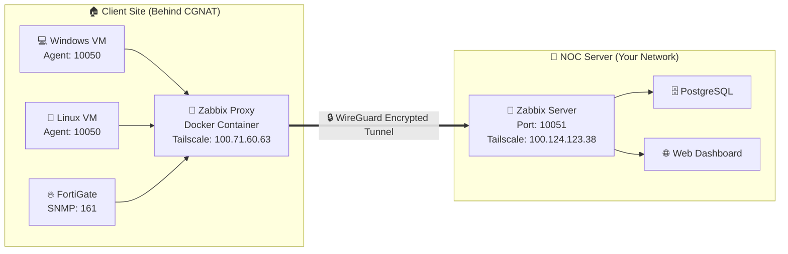

<div align="center">

# 🖥️ Zabbix NOC — Multi-Tenant Enterprise Monitoring Platform

[](https://www.zabbix.com/)
[](https://www.docker.com/)
[](https://www.postgresql.org/)
[](https://tailscale.com/)
[](https://nginx.org/)
[](LICENSE)

**Production-grade, fully dockerized Zabbix 7.0 monitoring stack with a custom MSP (Multi-Tenant) Companies Management Module, secure Tailscale VPN proxy routing, and enterprise-level hardening — all deployable in a single command.**

> 🚀 **Project Architect & Author:** [Saichandram Sadhu](https://github.com/saichandram-sadhu)

---

</div>

## 📐 Network Architecture — Full Topology

<div align="center">
  
</div>

---

## 🧠 What is Zabbix? (A-to-Z Explanation)

### The Problem It Solves
Imagine you manage **50+ servers, switches, and firewalls** across multiple client offices. Without monitoring:
- ❌ You won't know if a server's disk is 95% full until it crashes
- ❌ You won't know if a client's internet went down until they call you
- ❌ You won't know if CPU usage has been spiking for hours

**Zabbix solves all of this.** It continuously monitors every device's health metrics (CPU, RAM, Disk, Network, Services) and **instantly alerts you** via email, Telegram, or SMS when something goes wrong — even before the client notices.

### Core Components

| Component | Role | Icon |
|---|---|---|
| **Zabbix Server** | The central brain. Collects all metrics, evaluates triggers, sends alerts | 🧠 |
| **Zabbix Proxy** | A local relay agent deployed at each client site. Collects data locally and pushes to the server | 🔁 |
| **Zabbix Agent** | A small service installed on each monitored machine (Windows/Linux). Reports metrics to the Proxy or Server | 📡 |
| **Zabbix Web UI** | A beautiful web dashboard (Nginx + PHP) where you view graphs, alerts, maps and configure everything | 🌐 |
| **PostgreSQL** | The database storing all configuration, history, and trend data | 🗄️ |

### How Data Flows (Step-by-Step)

<div align="center">
  
</div>

---

## ⚡ 1-Click Quick Start

### Prerequisites
- [Docker Engine](https://docs.docker.com/engine/install/) installed
- [Docker Compose](https://docs.docker.com/compose/install/) v2+ installed
- Minimum **2 GB RAM** and **20 GB Disk** available

### Launch

```bash
# 1. Clone the repository
git clone https://github.com/saichandram-sadhu/Zabbix.git
cd Zabbix

# 2. Start the entire stack (Server + Database + Web UI + Agent)
docker compose up -d

# 3. Verify all containers are running
docker compose ps
```

### Access the Dashboard

| Service | URL | Credentials |
|---|---|---|
| 🌐 **Zabbix Web UI** | `http://localhost` | Username: `Admin` / Password: `zabbix` |
| 🗄️ **PostgreSQL** | `localhost:5432` | User: `zabbix` / Password: `StrongPassword@123` |

### Enable the Custom Companies Module
1. Log in to Zabbix Web UI
2. Navigate to **`Administration`** → **`General`** → **`Modules`**
3. Click **`Scan directory`**
4. Enable **`Companies Management`** module
5. Access it from the left sidebar menu ✅

---

## 🔄 Zabbix Proxy — Active vs Passive Modes

<div align="center">
  
</div>

### Detailed Comparison

| Feature | 🟢 Active Proxy (Recommended) | 🟡 Passive Proxy |
|---|---|---|
| **Connection Direction** | Proxy → Server (Proxy initiates) | Server → Proxy (Server initiates) |
| **Port Forwarding** | ❌ Not required on client router | ✅ Required on client router |
| **Works behind CGNAT** | ✅ Yes | ❌ No |
| **Works with Dynamic IP** | ✅ Yes | ❌ No (needs Static IP) |
| **Data Buffering** | ✅ Buffers locally if connection drops | ❌ Server retries until timeout |
| **Best For** | Remote offices, Home labs, Cloud | Data centers with static public IPs |

### Why We Use Active Mode
In India (and many countries), home broadband ISPs like **GTPL, Jio, Airtel** use **CGNAT (Carrier-Grade NAT)**. This means:
- Your router does NOT get a real public IP address
- Port forwarding simply doesn't work (even if configured correctly)
- The solution is **Active Proxy + Tailscale VPN** = Zero port exposure, zero router config

---

## 🔐 Security Hardening Guide

### Step 1: Change Database Password

Open `docker-compose.yml` and replace `StrongPassword@123` in **all three services**:

```yaml
# Change in zabbix-db, zabbix-server, AND zabbix-web:
environment:
  - POSTGRES_PASSWORD=YourNewSecureDBPassword
```

Apply changes:
```bash
docker compose down && docker compose up -d
```

### Step 2: Change Zabbix Admin Password
1. Login to Zabbix Web UI → **`Users`** → **`Admin`**
2. Click **`Change password`** → Set new password → Click **`Update`**

### Step 3: Enable Multi-Factor Authentication (MFA)
1. Go to **`Administration`** → **`Authentication`** → **`MFA Settings`**
2. Add a TOTP provider (Google Authenticator / Authy)
3. Enforce MFA on the `Zabbix administrators` group

### Step 4: Firewall Configuration
```bash
# Allow only essential ports
sudo ufw allow 22/tcp      # SSH
sudo ufw allow 443/tcp     # HTTPS
sudo ufw allow 10051/tcp   # Zabbix Server
sudo ufw enable
```

### Step 5: Fail2Ban (Brute Force Protection)
```bash
sudo apt install fail2ban -y
sudo systemctl enable fail2ban
sudo systemctl start fail2ban
```

### Step 6: Apache/Nginx Security Headers
Add these headers to your web server config:
```
Header always set Strict-Transport-Security "max-age=31536000; includeSubDomains"
Header always set X-Content-Type-Options "nosniff"
Header always set X-Frame-Options "SAMEORIGIN"
Header always set Referrer-Policy "strict-origin-when-cross-origin"
ServerTokens Prod
ServerSignature Off
```

---

## 🌐 Remote Client Setup (Tailscale CGNAT Bypass)

### What is Tailscale?
Tailscale creates a **private encrypted mesh network** between your devices using the **WireGuard protocol**. Each device gets a permanent virtual IP (`100.x.x.x`) that never changes — even if your real internet IP changes.

### Architecture with Tailscale



### Setup Steps

<details>
<summary><b>📌 Step 1: Install Tailscale on Zabbix Server VM</b></summary>

```bash
# Download and install
curl -fsSL https://tailscale.com/install.sh | sh

# Start and authenticate (opens a browser link)
sudo tailscale up --accept-dns=false

# Note your virtual IP
tailscale ip -4
# Example output: 100.124.123.38
```
</details>

<details>
<summary><b>📌 Step 2: Install Tailscale on Client's Proxy VM</b></summary>

```bash
# Download and install
curl -fsSL https://tailscale.com/install.sh | sh

# Start and authenticate (use SAME Tailscale account as server)
sudo tailscale up --accept-dns=false

# Note your virtual IP
tailscale ip -4
# Example output: 100.71.60.63
```
</details>

<details>
<summary><b>📌 Step 3: Test Connectivity</b></summary>

```bash
# From Proxy VM, ping the Server's Tailscale IP
ping 100.124.123.38

# Expected: Replies received = Connection established ✅
```
</details>

<details>
<summary><b>📌 Step 4: Launch Zabbix Proxy Container</b></summary>

```bash
docker run --name zabbix-proxy -d \
  -e ZBX_SERVER_HOST="100.124.123.38" \
  -e ZBX_HOSTNAME="Proxy_Clientbeta" \
  --net=host \
  --restart unless-stopped \
  zabbix/zabbix-proxy-sqlite3:alpine-7.0-latest
```
</details>

<details>
<summary><b>📌 Step 5: Configure Zabbix Agents on Client VMs</b></summary>

Edit `zabbix_agentd.conf` on each monitored machine:
```ini
# Point to the local Proxy VM's IP (NOT the Tailscale IP)
Server=192.168.87.20
ServerActive=192.168.87.20

# Must match the host name configured in Zabbix Frontend
Hostname=Windows_Server_ClientBeta
```

Restart the agent:
```bash
# Linux
sudo systemctl restart zabbix-agent

# Windows (Run as Administrator)
net stop "Zabbix Agent" && net start "Zabbix Agent"
```
</details>

<details>
<summary><b>📌 Step 6: Register Proxy in Zabbix Server</b></summary>

1. Login to Zabbix Web UI
2. Go to **`Administration`** → **`Proxies`**
3. Click **`Create proxy`**
4. Set:
   - **Proxy name:** `Proxy_Clientbeta` (must match `ZBX_HOSTNAME` exactly)
   - **Proxy mode:** `Active`
5. Click **`Add`**
6. Wait 1-2 minutes — Status will turn **🟢 Green (Online)** ✅
</details>

---

## 🏢 Custom Companies Management Module

This repository includes a custom PHP module (`companies/`) that adds **MSP (Managed Service Provider) multi-tenant management** capabilities to Zabbix:

### Features
| Feature | Description |
|---|---|
| 📊 **Interactive KPI Dashboard** | Clickable summary cards showing Host Groups, Users, Connected Hosts count |
| 🔗 **Deep Linking** | KPI cards link directly to native Zabbix configuration pages |
| 👤 **User Badges** | Click any user badge to open their Zabbix profile |
| ⚡ **Live Alerts Panel** | Real-time problems panel linked to trigger event details |
| 🎨 **Modern CSS** | Hover transitions, gradient cards, responsive grid layout |

### Module Files
```
companies/
├── Module.php                          # Module registration & menu entry
├── manifest.json                       # Module metadata & version
├── actions/
│   ├── CompaniesListAction.php         # Main controller (data fetching)
│   ├── CompaniesCreateAction.php       # Company creation handler
│   └── CompaniesDeleteAction.php       # Company deletion handler
└── views/
    └── companies.list.php              # Frontend view (HTML + CSS + JS)
```

---

## 🗂️ Project Structure

```
Zabbix/
├── 📄 README.md                    # This documentation
├── 🐳 docker-compose.yml           # 1-click deployment stack
├── 📊 network_flow.svg             # Network architecture diagram
├── 📊 proxy_modes.svg              # Proxy modes comparison diagram
├── 📝 create_dashboard.py          # Python script for dashboard automation
├── 📝 manage_tenants.py            # Python script for tenant management
├── 📁 companies/                   # Custom MSP module (auto-mounted)
│   ├── Module.php
│   ├── manifest.json
│   ├── actions/
│   └── views/
└── 📄 Zabbix_Monitoring_Report.docx # Project documentation report
```

---

## 📋 Quick Reference — Important Ports

| Port | Protocol | Service | Direction |
|---|---|---|---|
| `10051` | TCP | Zabbix Server (Trapper) | Proxy → Server |
| `10050` | TCP | Zabbix Agent | Server/Proxy → Agent |
| `443` | TCP | HTTPS Web UI | Browser → Server |
| `5432` | TCP | PostgreSQL Database | Internal only |
| `161` | UDP | SNMP (Switches/Firewalls) | Proxy → Device |
| `41641` | UDP | Tailscale/WireGuard | Mesh (auto-configured) |

---

## ❓ Frequently Asked Questions

<details>
<summary><b>Q: Kya Tailscale hamesha free rahega?</b></summary>

**Haan!** Tailscale ka Personal plan hamesha ke liye free hai. Aapko **100 devices** aur **3 users** milte hain bina koi paisa diye. Virtual IPs permanent hain aur kabhi change nahi hoti.
</details>

<details>
<summary><b>Q: Server restart hone par Tailscale automatic start hoga?</b></summary>

**Haan!** Tailscale install hote hi systemd service me register ho jata hai (`tailscaled.service`). Server boot hone par automatic reconnect ho jayega. Verify karein: `systemctl is-enabled tailscaled` → `enabled`
</details>

<details>
<summary><b>Q: Internet disconnect hone par data loss hoga kya?</b></summary>

**Nahi!** Active Proxy apne local SQLite database me saara data buffer karta hai. Jaise hi internet reconnect hota hai, buffered data automatically server ko push ho jata hai. **Zero data loss.**
</details>

<details>
<summary><b>Q: Ek Zabbix Server se kitne Proxies connect ho sakte hain?</b></summary>

**Unlimited.** Zabbix Server par koi hard limit nahi hai proxies ki. Aap 100+ client sites ko easily ek server se monitor kar sakte hain. Bas server ke RAM aur CPU capacity ke hisaab se scale karein.
</details>

<details>
<summary><b>Q: Kya mera personal data GitHub par gaya hai?</b></summary>

**Nahi!** Database data (`zabbix-db-storage` Docker volume) git me included nahi hai. Sirf configuration files, module code, aur documentation push hui hai. Koi bhi user clone karega toh use fresh Zabbix environment milega.
</details>

---

<div align="center">

### ⭐ Star this repository if it helped you!

Built with ❤️ by **Saichandram Sadhu**

[](https://github.com/saichandram-sadhu)

</div>
