# 🌐 SoluteLab Client Setup & Monitoring Deployment Guide

This guide details the end-to-end, production-grade configuration required to monitor client **`SoluteLab`**'s infrastructure from the central **TechMonarch NOC Server** using **Headscale VPN** and an **agentless Zabbix Proxy** deployment.

---

## 🗺️ 1. Network Topology & Architecture

Below is the visual network topology showing how data flows securely from the client's internal Windows Server to the NOC dashboard via the encrypted peer-to-peer WireGuard tunnel.



---

## 🔌 2. Central ISP Router Configuration (TechMonarch NOC Site)

Since the central site uses a standard ISP router instead of a dedicated hardware firewall, we must configure **Port Forwarding (NAT / Virtual Server)** to expose Headscale registration endpoints safely.

### **Step 1: Access Router Gateway**
1. Open a browser on the local NOC network and navigate to the router gateway IP (typically `http://192.168.1.1` or `http://192.168.1.254`).
2. Log in using the administrative credentials.

### **Step 2: Add Port Forwarding (NAT / Virtual Server) Rules**
Navigate to the **Port Forwarding / Virtual Server / NAT** tab and create the following two rules:

| Rule Name | External Port | Internal Port | Protocol | Internal Target IP (NOC VM) |
| :--- | :--- | :--- | :--- | :--- |
| **Headscale Web Control** | `8080` | `8080` | **TCP** | `192.168.1.178` |
| **Tailscale WireGuard P2P** | `41641` | `41641` | **UDP** | `192.168.1.178` |

> [!IMPORTANT]
> Do **NOT** port forward `10051 (TCP)` for Zabbix Server or `5432` for PostgreSQL to the public internet. These ports must remain strictly private, reachable only within the secure Headscale VPN tunnel network.

---

## 📡 3. Zabbix Proxy VM Sizing & Installation (Client Office Site)

The local Zabbix Proxy acts as an on-premise monitoring gateway. It collects metrics from the local network and relays them securely to the NOC.

### **A. Hardware Virtual Machine (VM) Sizing**
Provide a local VM in the client's LAN with the following specifications:
*   **Operating System**: Ubuntu Server 22.04 LTS (x86_64)
*   **Processor (vCPU)**: 1 core (2 cores recommended)
*   **Memory (RAM)**: 1 GB (2 GB recommended)
*   **Storage (SSD)**: 20 GB (SSD for database writes)
*   **Network**: Dedicated local IP address (e.g., `192.168.10.50`)

---

### **B. Step-by-Step CLI Installation Commands**

#### **Step 1: Generate Reusable Pre-Auth Key on TechMonarch NOC Server**
Before setting up the client side, run this command on your **NOC Server** to generate an automatic registration token:
```bash
docker exec headscale headscale preauthkeys create -u 1 --reusable -e 180d
```
*Copy the generated key (looks like `hskey-auth--L-GpV...`).*

#### **Step 2: Connect Tailscale on Client's Proxy VM**
Log in to the client's Proxy VM via SSH and run:
```bash
# 1. Install Tailscale client
curl -fsSL https://tailscale.com/install.sh | sh

# 2. Authenticate directly using the generated pre-auth key
sudo tailscale up --login-server http://122.170.96.200:8080 --accept-dns=false --authkey hskey-auth-Zpa3amo0ooUR-mXfSLN6xrHPlTSqF1_TK3qjomb1nxNGihQZKxxkEzeCVqSClgasCFOvFTAnKLsP5

# 3. Verify connection and check the assigned VPN IP (e.g. 100.64.0.3)
tailscale ip -4
```

#### **Step 3: Add Zabbix Official Repository (Version 7.0 LTS)**
```bash
# 1. Download repository config package
wget https://repo.zabbix.com/zabbix/7.0/ubuntu/pool/main/z/zabbix-release/zabbix-release_7.0-1+ubuntu22.04_all.deb

# 2. Install repository config
sudo dpkg -i zabbix-release_7.0-1+ubuntu22.04_all.deb

# 3. Update repository packages cache list
sudo apt update
```

#### **Step 4: Install Zabbix Proxy with SQLite3 Database**
```bash
sudo apt install zabbix-proxy-sqlite3 -y
```

#### **Step 5: Initialize the SQLite3 Database File**
```bash
# Create the directory for database
sudo mkdir -p /var/lib/zabbix

# Assign correct owner permissions to Zabbix daemon user
sudo chown -R zabbix:zabbix /var/lib/zabbix
```

#### **Step 6: Edit the Proxy Configuration file**
```bash
sudo nano /etc/zabbix/zabbix_proxy.conf
```
Update the following parameters inside the configuration file:
```ini
Server=100.64.0.2                       # Zabbix NOC Server VPN IP
Hostname=SoluteLab                      # Unique proxy ID matching Zabbix Web UI
DBName=/var/lib/zabbix/zabbix_proxy.db   # File path for SQLite3 DB
ProxyMode=0                             # 0 = Active mode (Proxy pushes data to Server)
```

#### **Step 7: Start and Enable the Proxy Daemon**
```bash
sudo systemctl enable zabbix-proxy
sudo systemctl start zabbix-proxy
sudo systemctl status zabbix-proxy
```

---

## 💻 4. Agentless Windows Monitoring Setup (SNMP)

To monitor a Windows machine (Windows Server, Windows 10, or Windows 11) without installing any agent software:

### **A. Enable SNMP on Windows Server**
1. Open **Server Manager** ➔ Click **Add Roles and Features**.
2. Under the **Features** list, select **`SNMP Service`** and install it.

### **B. Enable SNMP on Normal Windows 10 / Windows 11**
Select **one** of the two methods below to enable SNMP on normal client machines:

#### **Method 1: Using PowerShell (Recommended & Easiest)**
1. Open **PowerShell** as **Administrator**.
2. Run this command to install the SNMP client capability:
   ```powershell
   Add-WindowsCapability -Online -Name "SNMP.Client~~~~0.0.1.0"
   ```

#### **Method 2: Using Settings App (GUI)**
1. Open **Settings** ➔ Navigate to **Apps** ➔ **Optional features** (on Win 11: **System** ➔ **Optional features**).
2. Click **View features** (or **Add a feature**).
3. Search for **`SNMP`** or **`Simple Network Management Protocol`**.
4. Check the box and click **Install**.

---

### **C. Configure SNMP Service Properties**
1. Open the Windows **Services** console (`services.msc`).
2. Scroll down and locate the **`SNMP Service`**.
3. Right-click **SNMP Service** and select **Properties**.
4. Go to the **`Security`** tab:
   *   Under **Accepted community names**, click **Add**.
   *   Set Community Name: **`solutelab_noc_public`** and Rights: **`READ ONLY`**.
   *   Select **`Accept SNMP packets from these hosts`**, click **Add**, and enter the **Client Proxy VM's Local LAN IP** (e.g., `192.168.10.50`).
5. Click **Apply**, and restart the SNMP Service to load changes.

---

### **D. Alternative Registry Configuration (If "Security" tab is missing)**
On some Windows 10/11 systems, the **Security** tab is missing in `services.msc`. You can configure it directly via **PowerShell (Administrator)** instead:

```powershell
# 1. Set Community Name to solutelab_noc_public (4 = READ-ONLY)
New-ItemProperty -Path "HKLM:\SYSTEM\CurrentControlSet\Services\SNMP\Parameters\ValidCommunities" -Name "solutelab_noc_public" -Value 4 -PropertyType DWord -Force

# 2. Restrict to Proxy VM LAN IP (Replace 192.168.10.50 with actual Proxy IP)
New-ItemProperty -Path "HKLM:\SYSTEM\CurrentControlSet\Services\SNMP\Parameters\PermittedManagers" -Name "1" -Value "127.0.0.1" -PropertyType String -Force
New-ItemProperty -Path "HKLM:\SYSTEM\CurrentControlSet\Services\SNMP\Parameters\PermittedManagers" -Name "2" -Value "192.168.10.50" -PropertyType String -Force

# 3. Restart SNMP service to apply changes
Restart-Service -Name "SNMP"
```

---


### **B. Register the Host in Zabbix Web UI**
1. Navigate to **Data collection** ➔ **Hosts** ➔ **Create host**.
2. Set configuration values:
   *   **Host name**: `SoluteLab_Windows_Server`
   *   **Templates**: Link `Windows by SNMP`
   *   **Host Groups**: Select `SoluteLab`
   *   **Monitored by proxy**: Select `SoluteLab`
   *   **Interfaces**: Click **Add** ➔ Select **`SNMP`** ➔ Enter Local IP `192.168.10.100` and Port `161`.
3. Navigate to **`Macros`** tab ➔ Click **Inherited and host macros**:
   *   Add macro: `{$SNMP_COMMUNITY}` ➔ Value: `solutelab_noc_public`.
4. Click **Add**.

Within 60 seconds, Zabbix Proxy will poll the server on port 161 and send metrics securely to the NOC server!
